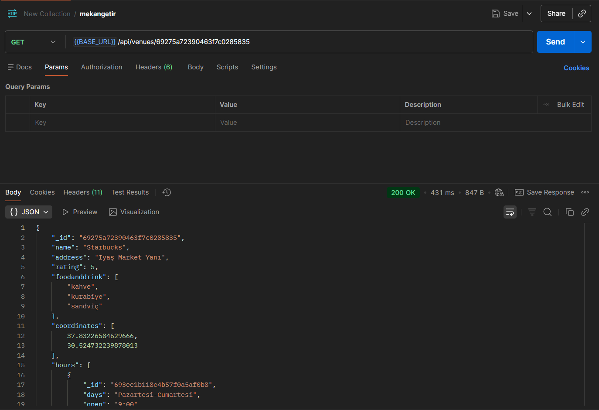
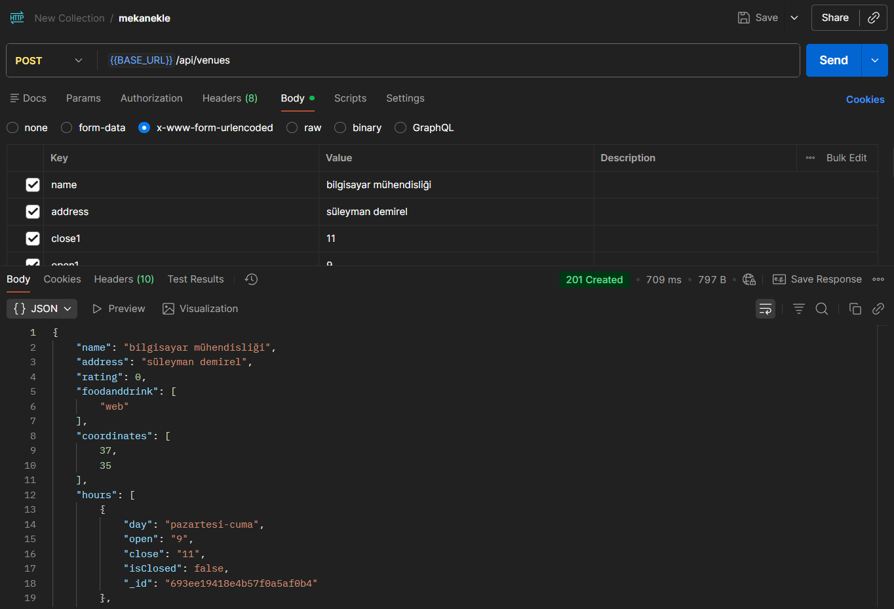
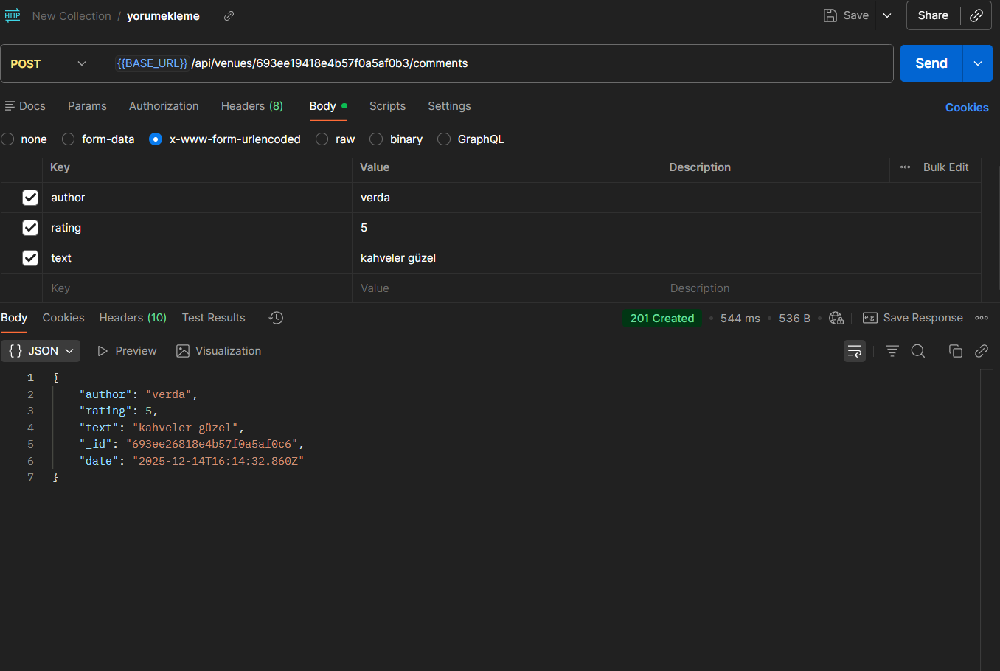

                               MEKANBUL BACKEND
vercel link:https://backend-five-pi-86.vercel.app/

API Endpoints

   .Tüm mekanları listele: GET/api/venues   
   .Yeni mekan ekle: POST/api/venues  
   .Mekan detayını getir: GET/api/venues/:venuid  
   .Mekanı güncelle: PUT/api/venues/:venueid  
   .Mekanı sil: DELETE/api/venues/:venuid  
   .Yorum ekle(mekana): POST/api/venues/:venueid/comments  
   .Yorum getir:GET/api/venues/: venueid/comments/:commentid  
   .Yorum güncelle: UT/api/venues/:venueid/comments/:commentid   
   .Yorum sil: DELETE/api/venues/:venueid/comments/:commentid  

Postman Test Sonucu=Aşağıda Postman ile alınmış test sonuçlarının ekran görüntüsü bulunmaktadır:

                                                                                                                                                             
 

 

 

 

 

                                                                                                                                                                                              
 

                  
